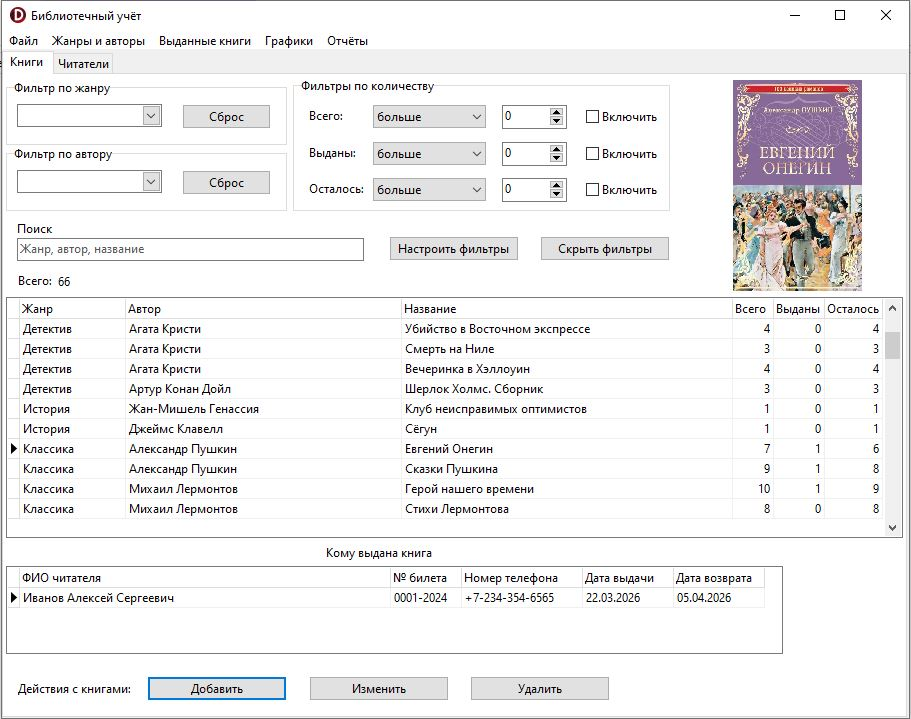
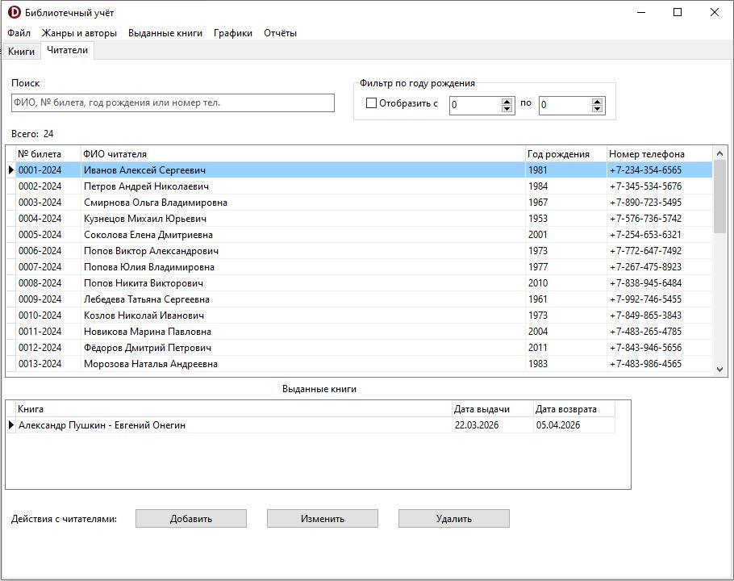
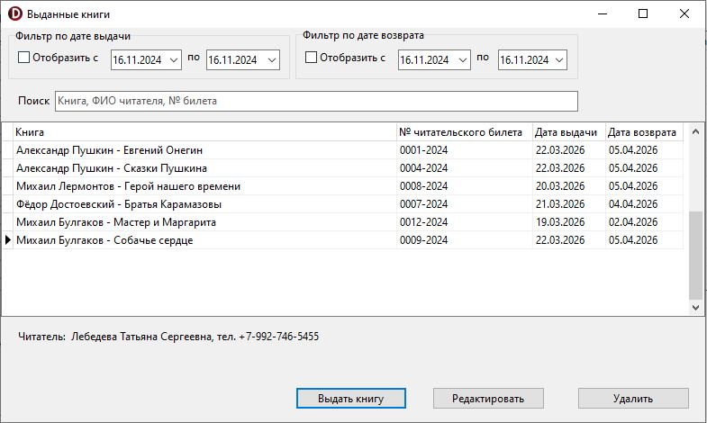
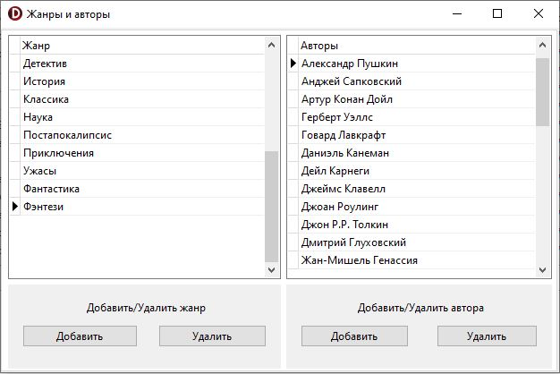

# Library
Автоматизированная система библиотечного учёта

## Описание
Десктопное приложение для автоматизации библиотечного учёта. Решает задачи управления библиотечным фондом, учёта читателей, операциями выдачи и возврата книг.

Приложение предоставляет пользователю возможности:
- Добавлять, редактировать и удалять информацию о книгах и читателях
- Фиксировать выдачу книг читателям с установкой дат выдачи и возврата
- Осуществлять поиск, фильтрацию и сортировку книг, читателей и записей по выданным книгам
- Добавлять и удалять авторов и жанры

Доступны для просмотра три вида графиков:
- Столбчатая диаграмма наиболее популярных выданных книг
- График динамики количества выданных книг за временной период
- Круговая диаграмма распределения книг по жанрам в библиотеке

Также доступно формирование документов для просмотра, сохранения и печати:
- Читательские билеты
- Книжные карточки
- Ревизионный перечень всех имеющихся в библиотеке книг, сгруппированных по жанрам с указанием количества экземпляров

## Стек
- Delphi
- MySQL
- TeeChart для построения графиков
- FastReport для формирования документов

### Настройка БД
Для подключения к БД используется драйвер MySQL ODBC 8.0 Unicode Driver. В проекте используется TADOConnection. Для подключения необходимо импортировать в СУБД MySQL файл "library 20241224 1648.sql" и отредактировать свойство ConnectionString у компонента ADOConnection1 на форме DataModule.dfm, указав SERVER, UID и PWD.

## Скриншоты

